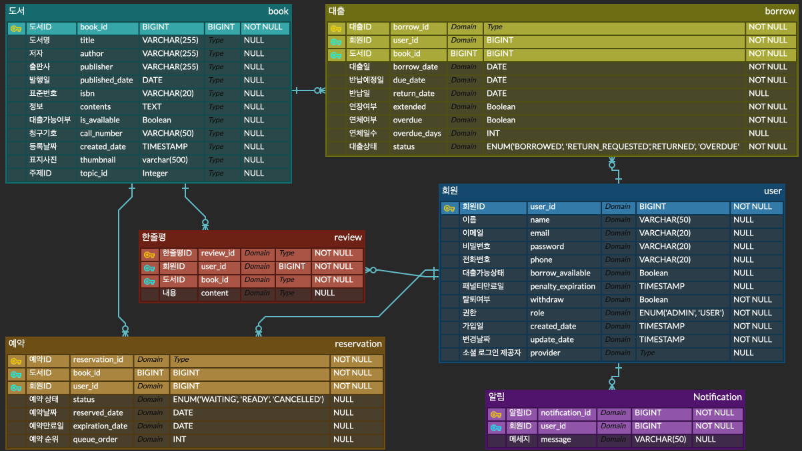
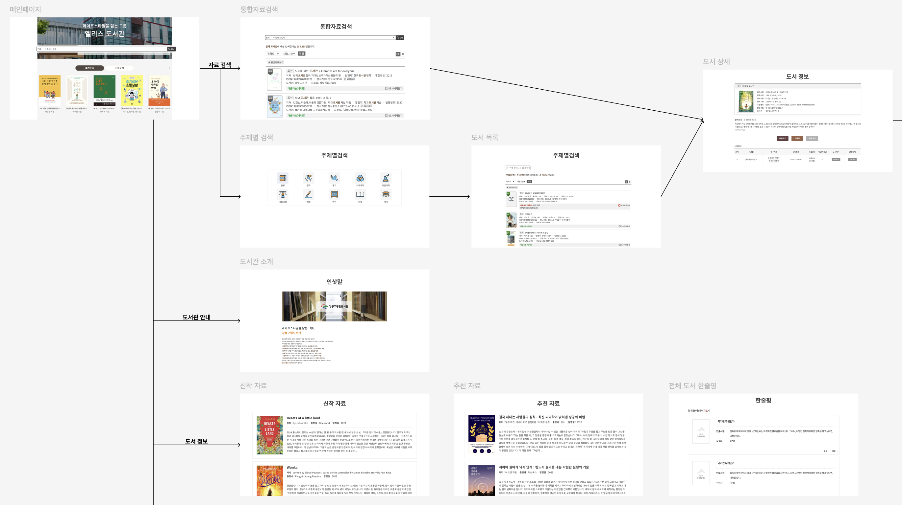

# LibDev


## 💬 설명

> 도서 데이터 및 추천 알고리즘을 활용한 도서관 대출 서비스 LibDev입니다.
<br>

## ⚙️ 기술 스택

### 백엔드

 


### 프론트엔드

 


<br><br>

## 🧩 ERD


<br><br>

## ⛓️ 와이어 프레임


<br><br>

## 🔥 기능
### 📌 Review API 작성
```
review
├── controller
│   ├── ReviewAPIController.java
│   └── ReviewViewController.java
├── dto
│   └── ReviewDto.java
├── entity
│   └── Review.java
├── filter
│   └── ProfanityFilter.java
├── mapper
│   └── ReviewMapper.java
├── repository
│   └── ReviewRepository.java
└── service
    └── ReviewService.java
```
### 한줄평 작성/수정
| 항목 | 내용 |
| --- | --- |
| URL | `POST /api/review`  `PUT /api/review/{reviewId}` |
| 접근 조건 | 로그인 필요 |
| 권한 조건 | 작성자 본인 OR ADMIN |
| 위치 제한 | 도서 상세 페이지에서만 작성 가능 |
| 입력 제한 | 100자까지 입력 가능 |
| 비속어 필터링 | Profanity Filter API 사용, 비속어 포함 시 등록/수정 불가 |
| 이미지 |    |

### 한줄평 삭제
| 항목 | 내용 |
| --- | --- |
| URL | `DELETE /api/review/{reviewId}` |
| 접근 조건 | 로그인 필요 |
| 권한 조건 | 작성자 본인 OR ADMIN |
| 이미지 |  |

### 전체 한줄평 조회
| 항목 | 내용 |
| --- | --- |
| URL | `GET /api/review` |
| 접근 조건 | 로그인 불필요 |

#### 도서별 한줄평 조회
| 항목 | 내용 |
| --- | --- |
| URL | `GET /api/review/book/{bookId}` |
| 접근 조건 | 로그인 불필요 |

### 유저별 한줄평 조회
| 항목 | 내용 |
| --- | --- |
| URL | `GET /api/review/user` |
| 접근 조건 | 로그인한 유저만 가능 |

#
### 📌 Recommendation API 작성
```
recommendation
├── controller
│   ├── RecommendationAPIController.java
│   └── RecommendationViewController.java
├── dto
│   └── RecommendationResponseDto.java
├── mapper
│   ├── PopularBookMapper.java
│   ├── SimilarBookMapper.java
│   ├── UserActivityMapper.java
│   └── UserBaseBookMapper.java
├── service
│   ├── RecommendationCacheService.java
│   └── RecommendationService.java
├── strategy
│   ├── PopularBookRecommendation.java
│   ├── RecommendationStrategy.java
│   ├── SimilarBookRecommendation.java
│   └── UserBaseBookRecommendation.java
└── vo
    ├── RecommendedBookVO.java
    └── UserBorrowActivityVO.java
```

```
resources
└── mybatis
    └── mapper
        └── recommendation
            ├── PopularBookMapper.xml
            ├── SimilarBookMapper.xml
            ├── UserActivityMapper.xml
            └── UserBaseBookMapper.xml
```
            
### 유사 도서 추천
| 항목 | 내용 |
| --- | --- |
| URL | `GET /api/recommendation/similar/{bookId}` |
| 사용 위치 | 도서 상세 페이지 |
| 추천 로직 | 기준 요소별 가중치를 적용한 유사도 계산 |
| 성능 최적화 | Redis 캐시 사용 |
| 이미지 |  |

### 사용자 기반 도서 추천
| 항목 | 내용 |
| --- | --- |
| URL | `GET /api/recommendation/user` |
| 사용 위치 | 메인 페이지, 추천 도서 페이지 |
| 추천 로직 | 대출 이력 기반 (대출 이력이 없거나 비로그인 상태면 인기 도서 추천 |
| 성능 최적화 | Redis 캐시 사용 (실시간성이 중요하여 새로운 대출 내역 발생 시 캐시 데이터 삭제) |
| 이미지 |  |

### 인기 도서 추천
| 항목 | 내용 |
| --- | --- |
| URL | `GET /api/recommendation/popular` |
| 사용 위치 | 사용자 기반 추천과 동일 |
| 성능 최적화 | Redis 캐시 사용 |
| 이미지 |  |

#
### 📌 공통 정책
### 비속어 필터링
| 항목 | 내용 |
| --- | --- |
| 사용 API | [Profanity Filter API](https://github.com/Whale0928/profanity-filter-api) |
| 적용 위치 | 한줄평 작성 및 수정 |
| 필터링 동작 | 비속어 포함 시 등록/수정 불가 |

### 권한 정책
| 사용자 유형 | 권한 |
| --- | --- |
| USER | 본인 작성 리뷰만 수정/삭제 가능 |
| ADMIN | 전체 리뷰 수정/삭제 가능 |
